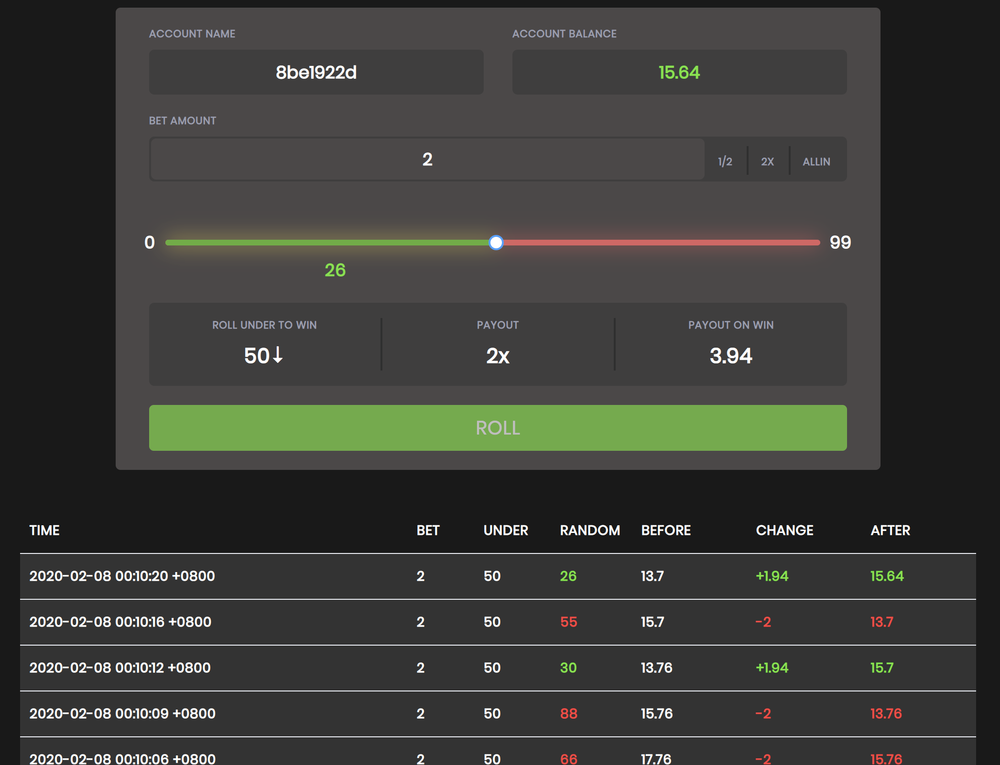

# DICE

 

## Background

The Dice game is simple—and classic. Choose a number, and click “roll” to generate a random number.

If you generate a number lower than the one you’ve selected, you win! otherwise, you lose.

You can select any number 2–96 to roll under; your payout multiplier varies based on the odds of you winning. But you will lose your bet if you lose.

The Dice game is now very popular on eos blockchain. Thanks to the decentralization of the blockchain, it is reliable and trusted.

## This Application

This programme is a local simulation of the dice gameplay. You can use fake money to practice and enhance strategies in order to get higher returns in real games.

## ScreenShot

It’s a very easy game to understand, and even easier to play.

## Install

* Download from newest release and unzip.
* Check config.json, customize port & admin password or stay default.

## Startup

    # For linux and darwin(macos)
    $ cd path-to-dice
    $ ./dice start
    $ ./dice status
    $ ./dice stop
    
    # For windows
    > cd path-to-dice
    > dice.exe
    # OR Double click "dice.exe"

Open http://localhost:2333/admin/auth in browser, input auth info (default: `admin/whosyourdaddy`).

Open http://localhost:2333/admin/key/apply , you will get an url like: 

    localhost:2333/api/start?ak=8be1922d&sk=0ef54d372b5f51368c43e20bf1e65658    

Just copy and paste the output as url and have fun !

Remember this url if you want to access this account the next time.

## Build

You need Go 1.13 environment

    make all

## Known issues and TODO

- [ ] cache and atomic write to db
- [ ] management webpage for admin
- [ ] banker income information
- [ ] sqlite requires CGO_ENABLED=1, which may block cross-platform build. Planning switch to blotdb

## License

MIT
